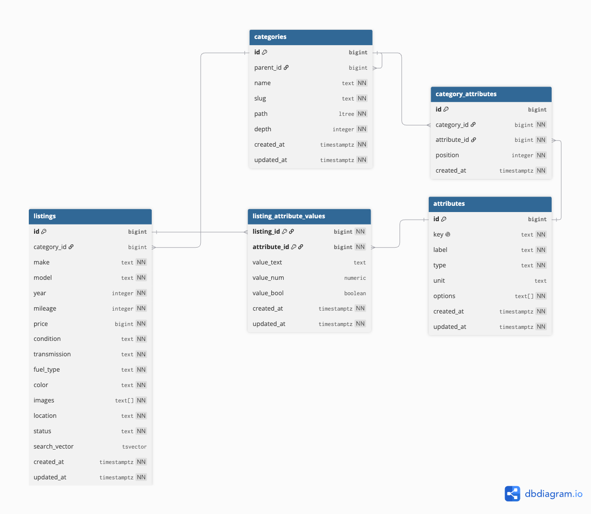

# Automotive Marketplace API

Production-oriented REST API for an automotive marketplace: vehicle listings, hierarchical categories, dynamic filter attributes, full-text and faceted search.

**Live:** <https://dri.ramadhanrizqi.web.id> · **Docs:** <https://dri.ramadhanrizqi.web.id/docs>
**Live:** <https://x96q.taila9f04a.ts.net> · **Docs:** <https://x96q.taila9f04a.ts.net/docs>

## Tech Stack

- **Runtime**: Node.js 24+ + NestJS + TypeScript
- **Database**: PostgreSQL 17 (raw SQL / query builder — no ORM)
- **Testing**: Vitest + Supertest
- **Lint/Format**: oxlint + Prettier

## Prerequisites

| Requirement | Version | Notes |
| --- | --- | --- |
| Node.js | 24 or newer | The Dockerfile and CI both pin `node:24-alpine`. |
| PostgreSQL | 17 | Needs the `ltree` and `pg_trgm` extensions; the migrations create them. |
| npm | bundled with Node | Dependencies are locked in `package-lock.json`. |

## Setup

```bash
npm install
cp .env.example .env
createdb automotive_marketplace
npm run migrate
npm run seed            # optional: 500 deterministic listings
npm run start:dev
```

## Architecture

One Nest application composed of four feature modules over a shared database
layer. Requests pass through a global `AttributeQueryPipe`, then a
`ValidationPipe`, then a controller; failures leave through a single
`ApiExceptionFilter`. No ORM sits in between — repositories issue parameterised
SQL against a `pg` pool.

```text
HTTP
 │
 ├─ AttributeQueryPipe   collapses attr.<key> / attr.<key>.min|max into `attributes`
 ├─ ValidationPipe       whitelist + coercion, per-DTO
 └─ Controller → Service → Repository → DatabaseService (pg Pool)
                                 │
                                 └─ ApiExceptionFilter → { error: { code, message, details? } }
```

| Module | Owns |
| --- | --- |
| `listings` | Listing lifecycle, keyset browse, full-text search, autocomplete |
| `categories` | Materialised-path tree, subtree browsing |
| `filters` | Category filter definitions, facet aggregation |
| `health` | Liveness plus database reachability |
| `shared/database` | Pool, transactions, migration runner, seeder |
| `shared/errors` | Error envelope and SQLSTATE→HTTP mapping |
| `shared/pagination` | Cursor codec |
| `shared/config` | Boot-time environment validation |

Cross-cutting rules live in one place rather than per feature: the listing
predicates are built once in `listings/listing-query.ts` and reused by browse,
count, search, suggest, and every facet query, so a facet count cannot drift
from the listing query it describes.

## Testing

```bash
npm run test        # unit tests
npm run test:e2e    # end-to-end tests against .env.test
npm run lint        # oxlint
```

The e2e suites boot the real application against the test database, so
`npm run migrate:test` must run once first. `.env.test` is tracked and points at
`automotive_marketplace_test`; `vitest.config.e2e.ts` copies its values into
`process.env` so the suite cannot fall back to `.env` and wipe development data.

## Environment Variables

| Variable | Description | Default |
| --- | --- | --- |
| `NODE_ENV` | `development` \| `test` \| `production` | `development` |
| `PORT` | HTTP port (≥ 1) | `3000` |
| `DATABASE_URL` | PostgreSQL connection string | — |
| `CORS_ORIGIN` | Comma-separated allowed origins | — (CORS off) |

Validated at boot — invalid values fail fast with a descriptive error.

## Database

Schema changes live in `src/shared/database/migrations/` as plain SQL and are
applied by a small forward-only runner. Applied files are recorded in
`schema_migrations`, so re-running is a no-op and a failed migration rolls back
completely.

```bash
npm run migrate         # apply pending migrations to DATABASE_URL
npm run migrate:test    # apply to the test database (.env.test)
```

## Schema Diagram



The diagram source is [`docs/schema.dbml`](docs/schema.dbml) — paste it into
[dbdiagram.io](https://dbdiagram.io) to regenerate the picture above, or render
it locally with `npx @dbml/cli dbml2sql docs/schema.dbml --postgres`. The
migrations under `src/shared/database/migrations/` remain the source of truth;
the DBML mirrors them and adds the notes the diagram cannot show.

Four tables carry the domain, and the relationships between them are the
schema's whole design:

| Relationship | Cardinality | Enforced by |
| --- | --- | --- |
| `categories.parent_id` → `categories.id` | many-to-one, self-referencing | FK, `ON DELETE RESTRICT`; `path`/`depth` CHECKs keep the materialised path honest |
| `listings.category_id` → `categories.id` | many-to-one, nullable | FK, `ON DELETE RESTRICT` — an uncategorised listing is allowed, deleting a used category is not |
| `category_attributes` → `categories` / `attributes` | one row per attachment | Composite `UNIQUE (category_id, attribute_id)`, both FKs `ON DELETE CASCADE` |
| `listing_attribute_values` → `listings` / `attributes` | one typed value per pair | `PRIMARY KEY (listing_id, attribute_id)`, `CHECK (num_nonnulls(value_text, value_num, value_bool) = 1)` |

`listings` also carries the stored generated `search_vector` column, and the
index families in [Indexing Strategy](#indexing-strategy) — the four partial
`listings_active_*` indexes, the `status`-prefixed family, the `lower()` and
trigram indexes on make/model/location, and the three partial value-column
indexes on `listing_attribute_values`.

## Seed Data

```bash
npm run seed            # reset and insert 500 listings
npm run seed 50         # reset and insert 50 listings
```

The seeder resets the category tree, the filter attribute definitions, and the
listings, then inserts the requested number of rows in batches. It also defines
the dynamic filter attributes (`engine_capacity`, `fuel_type`, `seat_count`,
`is_negotiable`), attaches them to the right categories, and writes a value for
every listing. `seat_count` is attached to Cars only, so the facets are exercised
against an attribute that is absent for part of the data.

Values come from a fixed-seed PRNG, so the same command always produces the same
rows; only `images` URLs are derived from the row index. It refuses to run when
`NODE_ENV=production`.

## Health

```bash
curl http://localhost:3000/health
# {"status":"ok","uptime":12.3,"timestamp":"...","database":"up"}
```

Returns `503` when the database is unreachable, so an orchestrator can stop
routing traffic instead of letting requests fail as `500`s.

## API

Interactive documentation is served from the running app:

| URL | Contents |
| --- | --- |
| `/docs` | Swagger UI |
| `/docs-json` | OpenAPI 3 document |

### Listings

| Method | Endpoint | Description |
| --- | --- | --- |
| `POST` | `/listings` | Create a listing |
| `GET` | `/listings` | Browse with filters, sorting, cursor pagination |
| `GET` | `/listings/:id` | Get a single listing |
| `PATCH` | `/listings/:id` | Update a listing |
| `DELETE` | `/listings/:id` | Soft delete (`status = removed`) |

Create:

```bash
curl -X POST http://localhost:3000/listings \
  -H 'Content-Type: application/json' \
  -d '{
    "make": "Toyota", "model": "Avanza", "year": 2021,
    "mileage": 35000, "price": 210000000,
    "condition": "used", "transmission": "manual", "fuelType": "petrol",
    "color": "Silver", "location": "Jakarta",
    "images": ["https://cdn.example.com/a.jpg"]
  }'
```

Browse:

```bash
curl 'http://localhost:3000/listings?fuelType=petrol&location=jakarta&minPrice=100000000&limit=20&sort=price&order=asc'
```

```json
{
  "data": [{ "id": 1, "make": "Toyota", "price": 195000000, "...": "..." }],
  "pagination": {
    "limit": 20,
    "hasMore": true,
    "total": 42,
    "nextCursor": "WzEsInByaWNlIiwyNjUwMDAwMDAsM10"
  }
}
```

Supported query parameters:

| Parameter | Notes |
| --- | --- |
| `make`, `model`, `location` | Case-insensitive exact match |
| `minPrice`, `maxPrice` | IDR, inclusive |
| `yearFrom`, `yearTo` | Inclusive |
| `minMileage`, `maxMileage` | Inclusive |
| `condition` | `new` \| `used` \| `certified` |
| `transmission` | `manual` \| `automatic` \| `cvt` |
| `fuelType` | `petrol` \| `diesel` \| `electric` \| `hybrid` |
| `status` | Defaults to every status except `removed` |
| `sort` | `createdAt` \| `price` \| `year` \| `mileage` \| `relevance` (requires `q`) |
| `order` | `asc` \| `desc` |
| `limit` | 1–100, default 20 |
| `cursor` | Opaque; from `pagination.nextCursor` |
| `q` | Full-text query over make, model, and location |
| `attr.<key>` | Dynamic attribute filter; enum/boolean take a value, range takes `attr.<key>.min` / `.max` |

### Errors

Every failure uses one envelope, so clients never branch on two shapes:

```json
{ "error": { "code": "not_found", "message": "Listing 42 not found" } }
```

Validation failures add a `details` array naming each offending field.

### Search & Filters

| Method | Endpoint | Description |
| --- | --- | --- |
| `GET` | `/listings/search` | Full-text search plus every browse filter |
| `GET` | `/listings/search/suggest` | Autocomplete for make, model, and city |
| `GET` | `/filters` | Filter options with counts for the current context |
| `GET` | `/filters/:categoryId` | Filter attributes a category exposes |

Search accepts the same parameters as `GET /listings` and adds `q`:

```bash
curl 'http://localhost:3000/listings/search?q=toyota&maxPrice=300000000&attr.fuel_type=petrol&limit=20'
```

```json
{
  "data": [
    {
      "id": 12, "make": "Toyota", "model": "Avanza", "price": 210000000,
      "attributes": { "engine_capacity": 1500, "fuel_type": "petrol", "is_negotiable": true },
      "...": "..."
    }
  ],
  "pagination": { "limit": 20, "hasMore": true, "total": 28, "nextCursor": "WzEsInJlbGV2YW5jZSIsMC42MDc5MjcxLDEyXQ" }
}
```

With `q` present the default sort is `relevance` (`ts_rank`); pass `sort` to
override it. Facets for the same context come from `GET /filters` with identical
parameters:

```bash
curl 'http://localhost:3000/filters?q=toyota&maxPrice=300000000'
```

```json
{
  "total": 28,
  "facets": [{ "key": "make", "values": [{ "value": "Toyota", "count": 28 }] }],
  "attributes": [
    { "key": "fuel_type", "type": "enum", "count": 28,
      "values": [{ "value": "petrol", "count": 11 }, { "value": "diesel", "count": 17 }] }
  ],
  "price": { "key": "price", "min": 112000000, "max": 298000000, "count": 28 },
  "year": { "key": "year", "min": 2015, "max": 2023, "count": 28 }
}
```

Autocomplete:

```bash
curl 'http://localhost:3000/listings/search/suggest?q=toy'
# {"data":[{"type":"make","value":"Toyota","count":28}]}
```

### Categories

| Method | Endpoint | Description |
| --- | --- | --- |
| `GET` | `/categories` | Full tree, nested by parent |
| `GET` | `/categories/:id` | Category with its direct children |
| `GET` | `/categories/:id/listings` | Listings in the category and its descendants |
| `POST` | `/categories` | Create a node |
| `PATCH` | `/categories/:id` | Rename |

Listings carry an optional `categoryId`. Filtering by a category includes every
descendant, and `GET /categories/:id/listings` exposes the same page scoped to a
subtree.

## Category Tree Strategy

Categories use a **materialised path** (`ltree`), not a parent-pointer-only
table.

The path is built from slugs (`cars.suv.5-seater`), so it is known at INSERT
time from the parent's path and needs no trigger or second pass. A CHECK
constraint ties the path to the node it describes: the last label must equal the
node's slug and `nlevel(path)` must equal its depth, so a stored path cannot
disagree with the tree.

Why `ltree` over a plain text path column with `text_pattern_ops`: on a 156-node,
4-level tree, descendant and ancestor lookups measured the same (~0.12 ms), so
performance did not decide it. `ltree` won on the model — the database rejects a
malformed path instead of storing it, ancestry is one operator (`path <@
'cars.suv'`) rather than a `LIKE` plus an equality case for the node itself, and
moving a subtree is `subpath()` over the descendants rather than string surgery
on every stored path.

Why not adjacency-list-only: recursive CTEs answer descendant queries but cannot
use an index for the recursion, so filtering listings by category would rescan
the tree on every request.

Category-scoped queries resolve the subtree as `category_id = ANY(ARRAY(SELECT …
WHERE path <@ …))`. Written as `IN (subquery)` the planner used a semi-join,
scanned the whole active index, and filtered afterwards — 35 ms on 50k rows
versus 0.17 ms for the array form, which the planner can use as an index
condition.

## Indexing Strategy

`listings` carries several index families, each tied to a query shape:

| Family | Serves |
| --- | --- |
| `listings_active_*` (partial, `WHERE status <> 'removed'`) | Default browse, one per sort key |
| `listings_status_*` (`status, <sort>, id`) | Explicit `status=` filters, including `removed` |
| `listings_{make,model,location}_lower_idx` | Combined equality filters on those columns |
| `listings_{make,model,location}_trgm_idx` (GIN) | Autocomplete prefix matches |
| `listings_search_vector_idx` (GIN) | Full-text `@@` and `ts_rank` |
| `listing_attribute_values_{text,num,bool}_idx` | Dynamic attribute filters, one per value column |

The partial family exists because the default browse predicate is an inequality.
`(status, created_at, id)` can only serve `status = ?`, so the planner fell back
to a sequential scan plus a top-N sort — on 50k rows that was 869 buffers and
~11 ms to return 21 rows, growing with table size. A partial index matching the
predicate gives an index-only scan at ~0.1 ms, and it still serves
`status='available'`/`pending`/`sold`; `status='removed'` is the one case the
partial index excludes, which the `listings_status_*` family covers.

`fuel_type`, `condition`, and `transmission` are deliberately **not** indexed.
With 3–4 distinct values an equality filter still matches a fifth of the table,
so the planner consistently preferred the sort index with a filter; `EXPLAIN`
produced identical plans with and without them. Migration `0002` drops them.

The dynamic-attribute indexes are partial (`WHERE value_num IS NOT NULL` and
friends) because a row only ever populates one of the three value columns; a full
index on all three would be two-thirds empty.

`ts_rank` returns `real`, so the relevance keyset expression casts it to
`float8`. Without the cast the cursor stores the float8 round-trip of a float4,
which compares *lower* than the stored rank and makes the next page re-serve
every row that shares the boundary score.

`EXPLAIN (ANALYZE)` on the search path, measured on 50k rows: the FTS predicate
uses `listings_search_vector_idx` as a bitmap index scan (0.98 ms for a term
matching ~1% of rows) rather than a sequential scan; the suggest predicate uses
the trigram index (4 ms versus 28 ms sequential). On the 500-row seed every plan
is a sequential scan, which is correct at that size.

## Dynamic Filter Attributes

Filter attributes are **rows, not columns**, so adding a business filter is data,
not a migration.

| Table | Role |
| --- | --- |
| `attributes` | One row per definition: `key`, `label`, `type`, `unit`, `options` |
| `category_attributes` | Which categories expose which attribute |
| `listing_attribute_values` | One typed value per listing and attribute |

The three types map to three value columns (`value_text`, `value_num`,
`value_bool`) rather than one text column plus casts: the filter predicate stays
index-supported (`value_num >= $1`), the `num_nonnulls(...) = 1` CHECK rejects a
value stored in the wrong shape, and no read has to guess how to cast.

Why not a `jsonb` column on `listings`: querying it per attribute needs an
expression index per attribute, which reintroduces exactly the
migration-per-filter the requirement rules out.

Attributes are global and attached through a join table rather than owned by one
category, because `engine_capacity` means the same thing on Cars and on
Motorcycles; one shared definition keeps its unit, label, and options from
drifting per branch. `GET /filters/:categoryId` returns the category's own
attributes plus every ancestor's (`c.path @> target`), so a leaf inherits what is
defined above it and a sibling branch never leaks in.

Query parameters are assembled from the `attr.` prefix by `AttributeQueryPipe`,
registered globally *before* `ValidationPipe`. This has to be a pipe rather than
a `@Transform` on the DTO: class-transformer only visits keys the source object
already has, so a transform on `attributes` never runs when the client sent
`attr.*`. Without it, `whitelist` would strip the prefixed keys as unknown
properties and the filters would be silently dropped.

Filtering reaches the values table through `EXISTS`, so a listing matching
several attributes stays one row and the planner can use the
`(attribute_id, value_*)` indexes.

## Search Strategy

`search_vector` is a **stored generated column** over `make`, `model`,
`location`, and `color`, weighted `A`/`A`/`B`/`C`. Stored, so it can never drift
from the row; generated, so no application path has to remember to update it.

The `simple` configuration is used, not `english`: vehicle makes, models, and
Indonesian city names are proper nouns, and stemming them (`avanza` -> `avanz`)
would only lose precision. Queries go through `websearch_to_tsquery`, which
parses the user's text safely (`or`, quoted phrases, `-term`) instead of
requiring a hand-rolled parser over `to_tsquery` syntax.

Autocomplete uses `pg_trgm` GIN indexes on the **bare** columns and matches
`col ILIKE 'prefix%'`. Deliberately not `lower(col) LIKE`: the indexes are
declared on `make`, `model`, and `location`, and wrapping the column in `lower()`
puts the expression out of their reach. Measured on 50k rows: 28 ms as a
sequential scan versus 4 ms as a bitmap index scan. `%` and `_` in the user's
input are escaped, so a literal underscore cannot widen the match.

Why PostgreSQL full-text search is sufficient here, instead of Elasticsearch:
the corpus is one table of structured listings, the ranking needed is
field-weight plus term frequency (not semantic or cross-field relevance), and
`ts_rank` over a GIN index answers it in single-digit milliseconds. Elasticsearch
would add a second datastore, a sync pipeline, and its own consistency problem —
real cost, for ranking this assessment does not need. The generated column means
an external index could be added later without changing the write path.

## Faceted Search Strategy

`GET /filters` accepts the same parameters as `GET /listings/search` and returns
counts for that exact context, so a facet count always equals the number of rows
the corresponding filter would return (there is a test asserting precisely
that).

Counts for the six column facets are produced in **one scan** via `GROUPING
SETS`:

```sql
GROUP BY GROUPING SETS
  ((make), (model), (fuel_type), (transmission), (condition), (location), ())
```

The empty grouping set rides along to carry the global `min`/`max` price and
year that the range facets need, so those are free rather than a second pass. One
query per facet would scan the same rows six more times.

Dynamic attributes are aggregated in two more queries — enum/boolean values get
per-value counts, `range` attributes report their observed span. A numeric
attribute has as many distinct values as listings, so per-value counts would
return a histogram nobody can render; `min`/`max` is what a slider needs.

Enum facets list **every declared option**, including ones currently matching
nothing, with `count: 0`. A filter panel has to render an unselected value rather
than have it vanish and reappear as filters change.

## Pagination Strategy

`GET /listings` uses keyset (cursor) pagination, not `OFFSET`.

The cursor encodes `[version, sortKey, sortValue, id]` as base64url. It carries
the sort key so a cursor cannot be reused against a different ordering, and the
`id` because a sort column alone is not a total order — rows sharing a price
would have an undefined position and could repeat or be skipped. The query
compares the tuple lexicographically (`(price, id) < ($1, $2)`), which matches
the composite indexes and keeps deep pages as cheap as the first.

`created_at` cursors carry Postgres' full microsecond text form rather than a
JavaScript `Date`: `Date` only holds milliseconds, and truncating would re-serve
the boundary row on the next page.

## Error Handling

`ApiExceptionFilter` renders every failure through one envelope and maps
Postgres SQLSTATE codes to the status they actually mean (`23505` → `409`,
`23514` → `400`), instead of leaking constraint violations as `500`s.

## Trade-offs & Known Limitations

Deliberate choices, each with the cost it accepts:

| Decision | Cost accepted |
| --- | --- |
| `count(*)` runs alongside every page | `pagination.total` is exact but is a second query per request; an approximate or cached count would be cheaper and is not needed at this size. |
| Facets are computed on demand | A `GET /filters` request re-aggregates the filtered set. Correct by construction (facet counts are asserted equal to the listing query) and there is no cache to invalidate. |
| Enum facets cap at 25 values | A long tail is dropped from the panel; the facet's `count` still describes the whole context. |
| Category `PATCH` renames but cannot reparent | Moving a node would rewrite every descendant's `path`; that is a separate operation and is not exposed. |
| Dynamic attributes are global, not per-category | `engine_capacity` keeps one unit/label/options across Cars and Motorcycles, at the cost of not being able to define two attributes with the same key differently per branch. |
| Attribute filters reach values through `EXISTS` | A listing matching several attributes stays one row, at the cost of a semi-join per attribute filter. |
| Migrations are forward-only | No `down` script; a failed migration rolls back its transaction, and a rollback of an applied migration is a manual operation. |
| Relevance sort requires `q` | `sort=relevance` without `q` is rejected rather than silently falling back to `createdAt`. |
| Cursor pagination cannot jump to a page number | `total` is returned for display, but `OFFSET`-style navigation is deliberately absent. |
| No authentication or rate limiting | Out of scope for the assessment; every endpoint is public and unauthenticated. A production deployment would need both in front of the write endpoints. |
| Soft delete only | `DELETE` sets `status = removed`; rows are never physically deleted, so the table grows and every read path must keep excluding `removed`. |

## Docker

The image is multi-stage: `npm ci` + `nest build` in the builder, then a
production-only `npm ci --omit=dev` runtime. The migration runner and its `.sql`
files are copied in because the runner reads them from disk at runtime, so a
release can migrate itself without shipping the source tree.

```bash
docker build -t dri-assessment .
docker run --rm -e DATABASE_URL=postgresql://... dri-assessment \
  node src/shared/database/migrate.ts
docker run --rm -p 3000:3000 -e DATABASE_URL=postgresql://... dri-assessment
```

## CI/CD

`.github/workflows/deploy.yml` runs two jobs:

| Job | Trigger | Steps |
| --- | --- | --- |
| `quality` | every push and PR | `npm ci`, `npm run lint`, `npm run migrate:test`, `npm run test:e2e` against a `postgres:17` service container |
| `publish` | pushes to `main` only | builds the image and pushes it to GHCR |

The image is published to `ghcr.io/ramadhanrzq/dri-assessment` with three tags:
the branch name, `sha-<full-commit>`, and `latest` (default branch only).
It authenticates with the built-in `GITHUB_TOKEN` — no extra secret is needed,
and the repository name is lowercased because GHCR rejects uppercase owners.

Pushing an image is where the workflow stops: pulling and running it is the
deployment platform's job.

```bash
docker pull ghcr.io/ramadhanrzq/dri-assessment:latest
docker run --rm -p 3000:3000 \
  -e DATABASE_URL=postgresql://... -e NODE_ENV=production \
  ghcr.io/ramadhanrzq/dri-assessment:latest
```

## Docker Compose (VPS)

`docker-compose.yml` runs the whole stack on one host: PostgreSQL, a one-shot
migration job, then the API.

```bash
cp .env.example .env     # then set POSTGRES_PASSWORD
docker compose up -d
docker compose logs -f api
```

| Service | Role |
| --- | --- |
| `db` | `postgres:17`, data on the `pgdata` volume, `pg_isready` healthcheck |
| `migrate` | runs the migration runner once, then exits |
| `api` | the image, published on `${API_PORT:-3000}`, polls `/health` |

Ordering is enforced by dependencies, not by sleep loops: `api` waits for
`db` to be healthy and for `migrate` to exit 0, so a fresh host never serves an
unmigrated schema. Re-running `up` re-runs `migrate`, which is a no-op once
`schema_migrations` is current.

Compose substitutes `${...}` from `.env`, but each service receives only the
variables listed under its own `environment` — the whole file is not injected.
`DATABASE_URL` is defined once via the `x-database-url` anchor, so the password
lives in one place.

| Variable | Purpose | Default |
| --- | --- | --- |
| `POSTGRES_PASSWORD` | database password; **required**, no default | — |
| `POSTGRES_USER` | database user | `postgres` |
| `POSTGRES_DB` | database name | `automotive_marketplace` |
| `API_PORT` | host port for the API | `3000` |
| `IMAGE` | image to run | `ghcr.io/ramadhanrzq/dri-assessment:latest` |
| `CORS_ORIGIN` | comma-separated allowed origins | empty (CORS off) |

`build: .` is present next to `image:`, so the same file works two ways:
`docker compose up -d --build` builds locally from the checkout, while a host
without the source just pulls `IMAGE`. Nothing is exposed except the API port;
PostgreSQL stays on the internal network.

The API container runs as the non-root `node` user. The image's `EXPOSE 3000`
is informational — `PORT` and the published port are what the API actually
binds.

Seeding is deliberately not a compose service: the seeder truncates tables and
refuses to run when `NODE_ENV=production`, which the image sets. Run it as a
one-off against the same database, clearing `NODE_ENV` for that single run:

```bash
docker compose run --rm --no-deps -e NODE_ENV= migrate \
  node src/shared/database/seed.ts 500
```

It reuses the `migrate` service because that one already carries `DATABASE_URL`
and the copied seed script, and `--no-deps` keeps it from restarting the stack.
Nothing seeds on `up`, so a restart never wipes the database.

## Live Deployment

**Base URL: <https://dri.ramadhanrizqi.web.id>**

| Resource | URL |
| --- | --- |
| API base | <https://dri.ramadhanrizqi.web.id> |
| Swagger UI | <https://dri.ramadhanrizqi.web.id/docs> |
| OpenAPI 3 document | <https://dri.ramadhanrizqi.web.id/docs-json> |
| Health / readiness | <https://dri.ramadhanrizqi.web.id/health> |

The instance runs the image from this repository behind a managed PostgreSQL
database, with migrations applied and 500 seeded listings. It is public and
needs no local setup:

```bash
curl https://dri.ramadhanrizqi.web.id/health
# {"status":"ok","uptime":47392.8,"timestamp":"2026-09-24T02:16:31.267Z","database":"up"}

curl 'https://dri.ramadhanrizqi.web.id/listings/search?q=toyota&limit=1'
curl 'https://dri.ramadhanrizqi.web.id/filters?q=toyota'
curl 'https://dri.ramadhanrizqi.web.id/listings/search/suggest?q=toy'
# {"data":[{"type":"make","value":"Toyota","count":28}]}

curl https://dri.ramadhanrizqi.web.id/categories
```

The 500 seeded rows split across statuses (`available` 122, `pending` 135,
`sold` 123, `removed` 120), so a default browse reports `total: 380` — the
`removed` rows are deliberately excluded unless `status=removed` is passed.

Verified against the live host: `/health` reports `database: "up"`; browse,
full-text search, facet counts, category tree, category-scoped browse
(`/categories/1/listings` → `total: 285`), autocomplete, and both Swagger URLs
all respond. See [Deployment](#deployment) for how this instance was produced.

## Deployment

The image is published to GHCR by CI (see [CI/CD](#cicd)), so a host only needs
Docker and a PostgreSQL instance. Two supported paths:

**Compose (whole stack on one host)** — the fastest route to a public URL:

```bash
cp .env.example .env          # set POSTGRES_PASSWORD, CORS_ORIGIN
docker compose up -d          # db -> migrate (one-shot) -> api
docker compose logs -f api
```

**Image only (managed database)** — point `DATABASE_URL` at the provider's
Postgres and run the migration once before the API:

```bash
docker run --rm -e DATABASE_URL=postgresql://... \
  ghcr.io/ramadhanrzq/dri-assessment:latest node src/shared/database/migrate.ts
docker run -d -p 3000:3000 -e NODE_ENV=production \
  -e DATABASE_URL=postgresql://... -e CORS_ORIGIN=https://example.com \
  ghcr.io/ramadhanrzq/dri-assessment:latest
```

Production environment variables are the same four the app validates at boot:
`NODE_ENV=production`, `PORT`, `DATABASE_URL`, `CORS_ORIGIN`. No secret is
baked into the image — `DATABASE_URL` is injected at run time.

Verify a deployment:

```bash
curl https://<host>/health        # {"status":"ok",...,"database":"up"}
curl 'https://<host>/listings?limit=1'
curl 'https://<host>/filters?q=toyota'
open https://<host>/docs          # Swagger UI
```

`/health` answers `503` when the pool cannot reach the database, so the same
endpoint works as the platform's readiness probe.

> **Live instance:** <https://dri.ramadhanrizqi.web.id> — see
> [Live Deployment](#live-deployment) above for the verified endpoints.

## Scripts

```bash
npm run start:dev   # watch mode
npm run build       # compile
npm run lint        # oxlint
npm run test        # unit tests
npm run test:e2e    # e2e tests (uses .env.test)
npm run migrate     # apply migrations
npm run seed        # reset and seed listings
```
